<!-- profile readme v2 — regenerated with real contribution data; the heatmap
is rebuilt daily by .github/workflows/update-profile-art.yml -->
<!-- hero: monochrome ASCII portrait (types in) beside the extruded 3d ascii
wordmark (wipes in left-to-right, then rocks on its vertical axis).
widths are picked so both panels land at the same height.
portrait: python scripts/prep_photo.py <photo> && python scripts/make_ascii_svg.py
wordmark: python scripts/make_wordmark_svg.py --mode rock -->
<h3><code>sankalp@github ~ $ whoami</code></h3>
<table>
<tr>
<td valign="top"></td>
<td valign="top"></td>
</tr>
</table>
 
 
<!-- animated contribution graph: real data, boxes reveal cell by cell
(regenerated daily by .github/workflows/update-profile-art.yml) -->
<h3><code>sankalp@github ~ $ ./contributions.sh</code></h3>

 
 
<h3><code>sankalp@github ~ $ ./links.sh</code></h3>

<b>Developer · Student · Building things that make life easier</b>

  

 

